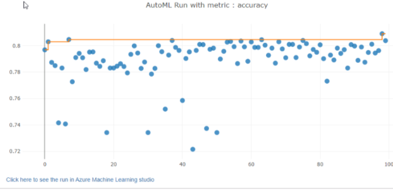

# Telco Customer Churn Prediction 
###  Overview
This project is about predicting customer churn for telco customers. It used the dataset from [Kaggle](https://www.kaggle.com/blastchar/telco-customer-churn). It is a classification problem which focuses on predicting whether or not the customers left within the last month (this value is called Churn and it has two values: Yes or No. )
### Dataset

The data set includes information about: 
  1 Services that each customer has signed up for – phone, multiple lines, internet, online security, online backup, device protection, tech support, and            streaming TV and movies
  2 Customer account information – how long they’ve been a customer, contract, payment method, paperless billing, monthly charges, and total charges
  3 Demographic info about customers – gender, age range, and if they have partners and dependents
  4 Customers who left within the last month – this is the column is called Churn which has to be predicted.

### Task: 
#### Explain the task you are going to be solving with this dataset and the features you will be using for it.
The task that is going to be solved using this dataset is prediction of Customer Churn using the the rest of the features of that customer. In the train.py file, the dataset is first cleaned by dropping unnecessary columns like  "gender","MultipleLines" and "PaymentMethod" etc.

### Access:
#### Explain how you are accessing the data in your workspace.

The data is downloaded from Kaggle and uploaded to a github repository whose link is provided in the notebook, then using TabularDatasetFactory method, it is converted to tabular format, and then it is registered with the key of “data” and uploaded to Azure workspace.

### Automated ML:
#### Give an overview of the `automl` settings and configuration you used for this experiment

This configuration object contains and persists the parameters for configuring the experiment run, as well as the training data to be used at run time. 

AutoML Config Parameters: 
   1. In AutoML config, we set the experiment timeout in minutes to be 30, which is the maximum time in minutes that each iteration can run for before it      terminates. 
   2. The total number of different algorithm and parameter combinations to test during an automated ML experiment are called iterations, which are set to be 100.
   3. Maximum concurrent iterations to 8 which represents the maximum number of iterations that would be executed in parallel.
   4. Number of cross-validations is set to be 5, which represents how many cross validations to perform when user validation data is not specified.  Since 5 folds cross validations are being performed, so for each training we use 4/5 th of data and 1/5 th of data is  used in each validation with a different holdout fold each time. 
   5. Task is classification which means only classification algorithms will be chosen in the AML Run.
   5. The metric that Automated Machine Learning will optimize for model selection is called primary metric, here it is set to accuracy, which means the algorithms will chosen based on the highest accuracy.
   6. Training data is given as "data".
   7. Compute target is the Azure Machine Learning compute target to run the Automated Machine Learning experiment on, it is set to the name of the compute we created above.
   8. The label column which is going to be predicted is “Churn”. 
   

### Results: 
#### What are the results you got with your automated ML model? What were the parameters of the model? How could you have improved it?

The  top contender if AutoML is Voting Ensemble model with accuracy of 80.9%. The model can be improved by increasing the number of iterations, changing the timeout to let the automl run for more than 30 minutes and using neural networks for classification.

AutoML Results:

AML Run with Metric:
 

AML Best Run: 
 

AML Best Run Completed:
 

## Hyperparameter Tuning :What kind of model did you choose for this experiment and why? Give an overview of the types of parameters and their ranges used for the hyperparameter search

Azure Hyperdrive package helps to automate choosing hyperparameter, which are adjustable parameters you choose for model training that guides the training process.

The model used is Logistic Regression as it utilizes a sigmoid function and works best on binary classification problems. It is implemented with scikit-learn.
The hyperparameters tuned are the inverse regularization strength -C ( Smaller values of C cause stronger regularization) and maximum iterations(max_iter) and a random sampling method over the search space.
The range for hyperparameters: 
Inverse regularization(C): (0.01, 0.1, 1, 10, 100, 1000, 10000)
Maximum iterations: (25,90,150,200)
A primary metric "Accuracy" is specified, which must be maximized to optimize the hyperparameter tuning experiment.
The parameters sampler chosen is Random Sampling, in which algorithm parameter values can be chosen from a set of discrete values or a distribution over a continuous range. Random sampling supports early termination of low-performance runs. We can users do an initial search with random sampling and then refine the search space to improve results.
Early stopping policy: I used a BanditPolicy with evaluation_interval of 5 and slack_factor of 0.1. Since early termination policies cause the poorly performing experiment runs to be cancelled so any run that doesn't fall within the slack factor or slack amount of the evaluation metric with respect to the best performing run will be terminated. This means that after every 5 intervals, any run with its accuracy less than the best performing run's accuracy minus slack_factor 0.1 will be terminated. This saves us computational time since low-performance runs will be terminated.

### HuperDrive 
#### Results What are the results you got with your model? What were the parameters of the model? How could you have improved it?

The hyperdrive model model gave an accuracy of 81.6% with the following hyperparameters: C = 1000 and maximum iterations of 20. It performed better than AutoML’s best run so it will be deployed. The model could be improved by increasing the maximum number of iterations from 20.

Hyperdrive Run Details:

Hyperdrive Top Runs 

Hyperdrive Run Primary Metric:

Hyperdrive parameters:

Hyperdrive Best Run and Parameters are given below:

Hyperdrive Best Run Details:

### An overview of the top two models with the best parameters
1. The whole hyperdrive run took about 13m 49.48s. In hyperdrive, the top performing model had an accuracy of 81.6% with the following parameters:
{'Regularization Strength:': 1000.0,
 'Max iterations:': 20,
 'accuracy': 0.8161137440758294}
 The second best model had an accuracy of 81.6% with the following parameters:
{'Regularization Strength':10,
'Max iterations': 90,
'accuracy':0.8123222748815165}
2. The automl run took about 41 minutes to complete. The best AML model had an accuracy of 81.6% with the Voting Ensemble model with 100% sampling. Other parameters were:
AUC weighted: 0.84807
ensemble_weights : [0.07692307692307693, 0.15384615384615385, 0.23076923076923078, 0.07692307692307693, 0.07692307692307693, 0.15384615384615385, 0.15384615384615385, 0.07692307692307693]
ensembled_algorithms : ['LightGBM', 'LightGBM', 'LightGBM', 'LightGBM', 'LightGBM', 'LightGBM', 'LightGBM', 'ExtremeRandomTrees']
ensembled_iterations : [41, 80, 88, 47, 6, 70, 73, 81]
F1 score weighted: 0.80119

The second best model was Standard Scaler model with LightBGM,it had an accuracy of 80.4%. The AutoML Run took about 30 minutes.

### Model Deployment
#### Give an overview of the deployed model and instructions on how to query the endpoint with a sample input.
 
The best model from hyperdrive run is first registered and then deployed locally. To deploy locally, the code is modified using LocalWebservice.deploy_configuration() to create a deployment configuration. Then we use Model.deploy() to deploy the service

Here the ACI Webservice has been successfully deployed and it can be seen that the service state is healthy.

 
 
Query Model Endpoint: For querying the endpoint, service.run() method is used. First,store the scoring uri,, then we create the header with key "Content-Type" and value "application/json" and then we create the sample input and post to the requests. Here is the sample input: 

data={"data":[{'SeniorCitizen':0, 'Partner': True, 'Dependents':False, 'PhoneService':False,'PaperlessBilling':True, 'MonthlyCharges':29.85, 'TotalCharges':29.85,'InternetService_DSL':1, 'InternetService_Fiber optic':0,'InternetService_No':0, 'OnlineSecurity_No':1,'OnlineSecurity_No internet service':1, 'OnlineSecurity_Yes':1,'OnlineBackup_No':0, 'OnlineBackup_No internet service':0,'OnlineBackup_Yes':1, 'DeviceProtection_No':1 ,'DeviceProtection_No internet service':0, 'DeviceProtection_Yes':0,'TechSupport_No':0, 'TechSupport_No internet service': 0, 'TechSupport_Yes':0,'StreamingTV_No':0, 'StreamingTV_No internet service':0, 'StreamingTV_Yes':0,'StreamingMovies_No':1, 'StreamingMovies_No internet service':0,'StreamingMovies_Yes':0, 'Contract_Month-to-month':1 , 'Contract_One year':0,'Contract_Two year':0}]}

The response status code is 200 which indicates that the request has succeeded. Then we use the service.run method to print the predictions. The model gives “False” which means that the customer has not churned 

Endpoint status can be seen below.

REST Endpoint is visible here 
 

### Screen Recording [Link](https://drive.google.com/file/d/1ESHHbGsoX0LrqtUuhcB1GBS_Ncj-z-4_/view?usp=sharing)

### Further Improvements: 
This model can be improved by changing the model from Logistic Regression to more complec models like RandomForest or XG Boost classifier. We can also use
ensemble methods for a higher accuracy. 

### Standout Suggestions
Application Insights have been enabled

